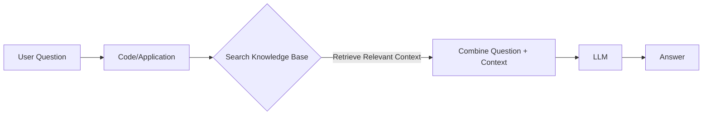

# Retrieval Augmented Generation (RAG)

RAG is a technique that combines the capabilities of a Large Language Model (LLM) with an external knowledge base. It allows the LLM to answer questions using specific, private, or up-to-date information that it wasn't trained on.

## Use Case: Insurance Tech Startup
**Goal:** Build an AI Knowledge Worker for "Insurellm" that can answer questions about company products and employees using a private knowledge base on a shared drive.

### Approach 1: The "Blunt" Approach (Naive RAG)
1.  **Read** names of products and employees from the knowledge base.
2.  **Identify** if the user's question refers to a specific product or employee.
3.  **Retrieve** the full document associated with that entity.
4.  **Inject** the document content into the LLM's prompt context.
5.  **Generate** the answer using the LLM.

---

## LLM Architectures

There are two main types of LLM architectures relevant to this discussion:

### 1. Auto-Regressive Models (Decoder-Only)
*   **Function:** Trained to predict the next token in a sequence.
*   **Examples:** GPT-4, Llama 3, Claude.
*   **Use Case:** Text generation, chat, code writing.

### 2. Auto-Encoding Models (Encoder-Only)
*   **Function:** Takes a full input sequence and produces a vector representation (embedding) that captures its meaning. Does *not* generate text.
*   **Examples:** BERT, RoBERTa.
*   **Use Case:** Classification, sentiment analysis, **creating vector embeddings for search**.

---

## Vectors & Embeddings

**Concept:** Vectors turn text into numbers that represent "meaning".

*   **Input:** Tokens (text).
*   **Output:** A vector (a list of numbers, e.g., `[0.12, -0.98, 0.45, ...]`).
*   **Dimensions:** Typically hundreds or thousands (e.g., 1536 dimensions for OpenAI's `text-embedding-3-small`).

**Key Properties:**
*   **Semantic Similarity:** Inputs with similar meanings have vectors that are mathematically close to each other.
*   **Vector Math:** You can perform operations like `King - Man + Woman ≈ Queen`.

---

## The "Big Idea" Behind RAG

Modern RAG systems use **Vector Datastores** to efficiently find the most relevant information.

1.  **Ingestion (Preprocessing):**
    *   Break documents into chunks.
    *   Use an **Auto-Encoding Model** to turn each chunk into a vector.
    *   Store these vectors in a **Vector Datastore**.

2.  **Retrieval (Runtime):**
    *   **User asks a question.**
    *   **Code** converts the question into a vector (using the same model).
    *   **Search** the Vector Datastore for vectors that are mathematically closest to the question vector.
    *   **Retrieve** the original text chunks associated with those vectors.

3.  **Generation:**
    *   Give the retrieved text chunks + the original question to the **Auto-Regressive LLM**.
    *   LLM generates the answer.

> **Summary:** RAG is about finding the best "encoding tricks" (retrieval strategies) to get the most relevant context, so the LLM can give the best answer.