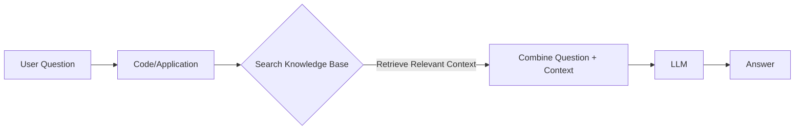

# Retrieval Augmented Generation (RAG)

RAG is a technique that combines the capabilities of a Large Language Model (LLM) with an external knowledge base. It allows the LLM to answer questions using specific, private, or up-to-date information that it wasn't trained on.

## Use Case: Insurance Tech Startup
**Goal:** Build an AI Knowledge Worker for "Insurellm" that can answer questions about company products and employees using a private knowledge base on a shared drive.

### Approach 1: The "Blunt" Approach (Naive RAG)
1.  **Read** names of products and employees from the knowledge base.
2.  **Identify** if the user's question refers to a specific product or employee.
3.  **Retrieve** the full document associated with that entity.
4.  **Inject** the document content into the LLM's prompt context.
5.  **Generate** the answer using the LLM.

---

## LLM Architectures

There are two main types of LLM architectures relevant to this discussion:

### 1. Auto-Regressive Models (Decoder-Only)
*   **Function:** Trained to predict the next token in a sequence.
*   **Examples:** GPT-4, Llama 3, Claude.
*   **Use Case:** Text generation, chat, code writing.

### 2. Auto-Encoding Models (Encoder-Only)
*   **Function:** Takes a full input sequence and produces a vector representation (embedding) that captures its meaning. Does *not* generate text.
*   **Examples:** BERT, RoBERTa.
*   **Use Case:** Classification, sentiment analysis, **creating vector embeddings for search**.

---

## Vectors & Embeddings

**Concept:** Vectors turn text into numbers that represent "meaning".

*   **Input:** Tokens (text).
*   **Output:** A vector (a list of numbers, e.g., `[0.12, -0.98, 0.45, ...]`).
*   **Dimensions:** Typically hundreds or thousands (e.g., 1536 dimensions for OpenAI's `text-embedding-3-small`).

**Key Properties:**
*   **Semantic Similarity:** Inputs with similar meanings have vectors that are mathematically close to each other.
*   **Vector Math:** You can perform operations like `King - Man + Woman ≈ Queen`.

---

## The "Big Idea" Behind RAG

Modern RAG systems use **Vector Datastores** to efficiently find the most relevant information.

1.  **Ingestion (Preprocessing):**
    *   Break documents into chunks.
    *   Use an **Auto-Encoding Model** to turn each chunk into a vector.
    *   Store these vectors in a **Vector Datastore**.

2.  **Retrieval (Runtime):**
    *   **User asks a question.**
    *   **Code** converts the question into a vector (using the same model).
    *   **Search** the Vector Datastore for vectors that are mathematically closest to the question vector.
    *   **Retrieve** the original text chunks associated with those vectors.

3.  **Generation:**
    *   Give the retrieved text chunks + the original question to the **Auto-Regressive LLM**.
    *   LLM generates the answer.

> **Summary:** RAG is about finding the best "encoding tricks" (retrieval strategies) to get the most relevant context, so the LLM can give the best answer.

### Set up the 2 key LangChain objects: retriever and llm

#### A sidebar on "temperature":
- Controls how diverse the output is
- A temperature of 0 means that the output should be predictable
- Higher temperature for more variety in answers

Some people describe temperature as being like 'creativity' but that's not quite right

* It actually controls which tokens get selected during inference
- temperature=0 means: always select the token with highest probability
- temperature=1 usually means: a token with 10% probability should be picked 10% of the time

Note: a temperature of 0 doesn't mean outputs will always be reproducible. You also need to set a random seed. We will do that in weeks 6-8. (Even then, it's not always reproducible.)

Note 2: if you want creativity, use the System Prompt!  Give it context and ask for something different!

## Python module implimentation

### ingest.py  

Read in Knowledge Base, break into chunks, create embeddings, and store in vector database

### answer.py

Read in question, create embedding, retrieve relevant context, and generate answer  
Two key functions:

1. fetch_context(question)  
2. answer_question(question, history)  

### app.py

A Gradio app that allows users to interact with the RAG system  

## Some issues with base implementation

1. It does not have history.

Question to Rag:
Who is Avery:  
- answer: about Avery Lancaster in the data.

Follow up question to Rag:
What is **her** salary?
- answer: Samantha Greene's salary is $70,000.

Issues:
1. It does not have history.
2. It does not have context.
3. It does not have a way to combine the context and the question.

## How `pro_implementation/answer.py` Fixes These Issues

The professional implementation addresses these limitations through three key mechanisms:

### 1. Query Rewriting (Fixes "No History" & "No Context" in Search)
When a user asks "What is **her** salary?", a standard vector search fails because "her" is ambiguous.
The `rewrite_query` function uses an LLM to interpret the question **in the context of the conversation history**.

*   **Input:** "What is her salary?" + History `[User: Who is Avery, AI: Avery is...]`
*   **Rewritten Query:** "What is Avery Lancaster's salary?"
*   **Result:** The database now searches for "Avery Lancaster", effectively retrieving the correct document.

### 2. Hybrid Retrieval (Fixes "Missing Context")
The system doesn't rely solely on the rewritten query. The `fetch_context` function performs a **hybrid search**:
1.  Searches for the **original question** ("What is her salary?").
2.  Searches for the **rewritten question** ("What is Avery Lancaster's salary?").
3.  **Merges** the results from both searches.

This ensures that we catch both direct matches and context-aware matches, significantly reducing the chance of missing relevant information.

### 3. Full Context Generation (Fixes "Combining Context and Question")
In the final step, `make_rag_messages` constructs the prompt for the LLM by combining:
*   **System Prompt:** Defines the persona and instructions.
*   **Retrieved Context:** The actual text chunks about Avery found in the database.
*   **Conversation History:** The previous turns of the chat.
*   **Current Question:** The user's latest input.

By seeing the full history AND the retrieved documents about Avery, the LLM allows the user to speak naturally ("her salary") while providing a precise, fact-based answer.